# 🎯 SƠ ĐỒ USE CASE - SMARTBUY E-COMMERCE

> **Hệ thống quản lý bán hàng điện thoại trực tuyến**

---

## 📐 SƠ ĐỒ USE CASE TỔNG QUAN

```mermaid
graph TB
    subgraph System["🏪 HỆ THỐNG SMARTBUY"]
        
        subgraph AuthGroup["🔐 QUẢN LÝ TÀI KHOẢN"]
            UC1[Đăng ký tài khoản]
            UC2[Đăng nhập]
            UC3[Đăng xuất]
            UC4[Quên mật khẩu]
            UC5[Cập nhật thông tin cá nhân]
            UC6[Đổi mật khẩu]
            UC7[Quản lý địa chỉ giao hàng]
        end
        
        subgraph ProductGroup["📦 QUẢN LÝ SẢN PHẨM"]
            UC8[Xem danh sách sản phẩm]
            UC9[Tìm kiếm sản phẩm]
            UC10[Lọc sản phẩm theo danh mục]
            UC11[Lọc theo giá]
            UC12[Lọc theo kích thước]
            UC13[Lọc theo màu sắc]
            UC14[Sắp xếp sản phẩm]
            UC15[Xem chi tiết sản phẩm]
        end
        
        subgraph CartGroup["🛒 QUẢN LÝ GIỎ HÀNG"]
            UC16[Thêm sản phẩm vào giỏ]
            UC17[Xem giỏ hàng]
            UC18[Cập nhật số lượng]
            UC19[Cập nhật sản phẩm trong giỏ]
            UC20[Xóa sản phẩm khỏi giỏ]
        end
        
        subgraph WishlistGroup["❤️ DANH SÁCH YÊU THÍCH"]
            UC21[Thêm vào yêu thích]
            UC22[Xem danh sách yêu thích]
            UC23[Chọn màu sắc]
            UC24[Chọn kích thước]
            UC25[Nhập số lượng]
            UC26[Mua ngay]
        end
        
        subgraph OrderGroup["📋 QUẢN LÝ ĐƠN HÀNG"]
            UC27[Thanh toán]
            UC28[Thay đổi địa chỉ nhận hàng]
            UC29[Thay đổi sản phẩm thanh toán]
            UC30[Chọn hình thức thanh toán]
            UC31[Xem lịch sử đơn hàng]
            UC32[Lọc đơn hàng theo trạng thái]
            UC33[Xem thông tin chi tiết đơn hàng]
        end
        
        subgraph PaymentGroup["💳 THANH TOÁN"]
            UC34[Thanh toán tiền mặt COD]
            UC35[Thanh toán ví VNPay]
        end
        
    end
    
    Customer[👤 Khách hàng] --> UC1
    Customer --> UC2
    Customer --> UC3
    Customer --> UC4
    Customer --> UC5
    Customer --> UC6
    Customer --> UC7
    Customer --> UC8
    Customer --> UC9
    Customer --> UC10
    Customer --> UC11
    Customer --> UC12
    Customer --> UC13
    Customer --> UC14
    Customer --> UC15
    Customer --> UC16
    Customer --> UC17
    Customer --> UC18
    Customer --> UC19
    Customer --> UC20
    Customer --> UC21
    Customer --> UC22
    Customer --> UC23
    Customer --> UC24
    Customer --> UC25
    Customer --> UC26
    Customer --> UC27
    Customer --> UC28
    Customer --> UC29
    Customer --> UC30
    Customer --> UC31
    Customer --> UC32
    Customer --> UC33
    Customer --> UC34
    Customer --> UC35
    
    style Customer fill:#e1f5fe,stroke:#01579b,stroke-width:3px
    style System fill:#f5f5f5,stroke:#424242,stroke-width:2px
    
    style AuthGroup fill:#e8f5e9,stroke:#2e7d32
    style ProductGroup fill:#fff3e0,stroke:#ef6c00
    style CartGroup fill:#fce4ec,stroke:#c2185b
    style WishlistGroup fill:#f3e5f5,stroke:#7b1fa2
    style OrderGroup fill:#e3f2fd,stroke:#1565c0
    style PaymentGroup fill:#fff9c4,stroke:#f9a825
```

---

## 📐 SƠ ĐỒ USE CASE ADMIN

```mermaid
graph TB
    subgraph AdminSystem["🏪 HỆ THỐNG QUẢN TRỊ SMARTBUY"]
        
        subgraph AdminAuthGroup["🔐 XÁC THỰC ADMIN"]
            A1[Đăng nhập Admin]
            A2[Xem Dashboard thống kê]
            A3[Xem biểu đồ doanh thu]
        end
        
        subgraph AdminProductGroup["📦 QUẢN LÝ SẢN PHẨM"]
            A4[Xem danh sách sản phẩm]
            A5[Thêm sản phẩm mới]
            A6[Sửa thông tin sản phẩm]
            A7[Xóa sản phẩm]
            A8[Quản lý variant sản phẩm]
            A9[Quản lý kho hàng]
            A10[Quản lý danh mục]
            A11[Thêm/sửa/xóa danh mục]
        end
        
        subgraph AdminOrderGroup["📋 QUẢN LÝ ĐƠN HÀNG"]
            A12[Xem danh sách đơn hàng]
            A13[Cập nhật trạng thái đơn hàng]
            A14[Xem chi tiết đơn hàng]
            A15[Thống kê đơn hàng]
            A16[Lọc đơn hàng theo trạng thái]
        end
        
        subgraph AdminUserGroup["👥 QUẢN LÝ NGƯỜI DÙNG"]
            A17[Xem danh sách người dùng]
            A18[Khóa/mở khóa tài khoản]
            A19[Phân quyền người dùng]
            A20[Xem thống kê người dùng]
        end
        
        subgraph AdminReviewGroup["⭐ QUẢN LÝ ĐÁNH GIÁ"]
            A21[Xem tất cả đánh giá]
            A22[Ẩn/hiện đánh giá]
            A23[Phản hồi đánh giá]
            A24[Lọc đánh giá theo rating]
        end
        
        subgraph AdminReportGroup["📊 BÁO CÁO & THỐNG KÊ"]
            A25[Xem thống kê tổng quan]
            A26[Báo cáo doanh thu]
            A27[Báo cáo sản phẩm bán chạy]
            A28[Báo cáo tồn kho]
            A29[Báo cáo khách hàng mới]
        end
        
    end
    
    Admin[👨‍💼 Quản trị viên] --> A1
    Admin --> A2
    Admin --> A3
    Admin --> A4
    Admin --> A5
    Admin --> A6
    Admin --> A7
    Admin --> A8
    Admin --> A9
    Admin --> A10
    Admin --> A11
    Admin --> A12
    Admin --> A13
    Admin --> A14
    Admin --> A15
    Admin --> A16
    Admin --> A17
    Admin --> A18
    Admin --> A19
    Admin --> A20
    Admin --> A21
    Admin --> A22
    Admin --> A23
    Admin --> A24
    Admin --> A25
    Admin --> A26
    Admin --> A27
    Admin --> A28
    Admin --> A29
    
    style Admin fill:#fff3e0,stroke:#e65100,stroke-width:3px
    style AdminSystem fill:#f5f5f5,stroke:#424242,stroke-width:2px
    
    style AdminAuthGroup fill:#e8f5e9,stroke:#2e7d32
    style AdminProductGroup fill:#fff3e0,stroke:#ef6c00
    style AdminOrderGroup fill:#e3f2fd,stroke:#1565c0
    style AdminUserGroup fill:#f3e5f5,stroke:#7b1fa2
    style AdminReviewGroup fill:#fff9c4,stroke:#f9a825
    style AdminReportGroup fill:#fce4ec,stroke:#c2185b
```

---

## 📋 CHI TIẾT CÁC USE CASE

### 👤 **KHÁCH HÀNG (Customer)**

#### **🔐 1. Quản lý tài khoản**
| ID | Use Case | Mô tả | Điều kiện |
|----|----------|-------|-----------|
| UC1 | Đăng ký tài khoản | Tạo tài khoản mới với email + OTP verification | Chưa có tài khoản |
| UC2 | Đăng nhập | Đăng nhập vào hệ thống bằng email/password hoặc OAuth (Google, Facebook) | Đã có tài khoản |
| UC3 | Đăng xuất | Thoát khỏi hệ thống, xóa session | Đã đăng nhập |
| UC4 | Quên mật khẩu | Khôi phục mật khẩu qua email + OTP | Quên mật khẩu |
| UC5 | Cập nhật thông tin | Chỉnh sửa tên, số điện thoại, avatar | Đã đăng nhập |
| UC6 | Đổi mật khẩu | Thay đổi mật khẩu đăng nhập | Đã đăng nhập |
| UC7 | Quản lý địa chỉ | Thêm/sửa/xóa/đặt mặc định địa chỉ giao hàng | Đã đăng nhập |

#### **📦 2. Quản lý sản phẩm**
| ID | Use Case | Mô tả | Điều kiện |
|----|----------|-------|-----------|
| UC8 | Xem danh sách | Hiển thị danh sách sản phẩm có phân trang | - |
| UC9 | Tìm kiếm | Tìm kiếm theo tên, hãng, model | - |
| UC10 | Lọc theo danh mục | Lọc iPhone, Samsung, Xiaomi, v.v. | - |
| UC11 | Lọc theo giá | Lọc trong khoảng giá tùy chọn | - |
| UC12 | Lọc theo kích thước | Lọc theo RAM/ROM (8GB/128GB, 12GB/256GB) | - |
| UC13 | Lọc theo màu sắc | Lọc theo màu: Đen, Trắng, Xanh, v.v. | - |
| UC14 | Sắp xếp | Sắp xếp theo giá tăng/giảm, mới nhất, bán chạy | - |
| UC15 | Xem chi tiết | Xem thông tin chi tiết: mô tả, giá, variants, đánh giá | - |

#### **🛒 3. Quản lý giỏ hàng**
| ID | Use Case | Mô tả | Điều kiện |
|----|----------|-------|-----------|
| UC16 | Thêm vào giỏ | Thêm sản phẩm (với variant cụ thể) vào giỏ hàng | Đã đăng nhập |
| UC17 | Xem giỏ hàng | Hiển thị danh sách sản phẩm trong giỏ + tổng tiền | Đã đăng nhập |
| UC18 | Cập nhật số lượng | Tăng/giảm số lượng sản phẩm trong giỏ | Đã đăng nhập |
| UC19 | Cập nhật sản phẩm | Thay đổi variant (màu, cấu hình) của sản phẩm trong giỏ | Đã đăng nhập |
| UC20 | Xóa khỏi giỏ | Xóa sản phẩm ra khỏi giỏ hàng | Đã đăng nhập |

#### **❤️ 4. Danh sách yêu thích**
| ID | Use Case | Mô tả | Điều kiện |
|----|----------|-------|-----------|
| UC21 | Thêm vào yêu thích | Lưu sản phẩm vào danh sách yêu thích | Đã đăng nhập |
| UC22 | Xem yêu thích | Hiển thị danh sách sản phẩm đã lưu | Đã đăng nhập |
| UC23 | Chọn màu sắc | Chọn màu khi thêm từ wishlist vào cart | Từ wishlist |
| UC24 | Chọn kích thước | Chọn RAM/ROM khi thêm từ wishlist vào cart | Từ wishlist |
| UC25 | Nhập số lượng | Nhập số lượng muốn mua | Từ wishlist |
| UC26 | Mua ngay | Thêm vào giỏ và chuyển đến checkout | Đã đăng nhập |

#### **📋 5. Quản lý đơn hàng**
| ID | Use Case | Mô tả | Điều kiện |
|----|----------|-------|-----------|
| UC27 | Thanh toán | Tạo đơn hàng từ giỏ hàng | Giỏ hàng có sản phẩm |
| UC28 | Thay đổi địa chỉ | Chọn/thêm địa chỉ giao hàng mới khi checkout | Checkout |
| UC29 | Chọn sản phẩm | Chọn sản phẩm cụ thể trong giỏ để thanh toán | Checkout |
| UC30 | Chọn hình thức | Chọn phương thức thanh toán (COD/VNPay) | Checkout |
| UC31 | Xem lịch sử | Hiển thị danh sách đơn hàng đã đặt | Đã đăng nhập |
| UC32 | Lọc theo trạng thái | Lọc: Chờ xử lý, Đang giao, Hoàn thành, Đã hủy | Xem lịch sử |
| UC33 | Xem chi tiết | Xem thông tin đầy đủ của đơn hàng: sản phẩm, giá, trạng thái, địa chỉ | Xem lịch sử |

#### **💳 6. Thanh toán**
| ID | Use Case | Mô tả | Điều kiện |
|----|----------|-------|-----------|
| UC34 | COD | Thanh toán khi nhận hàng (ship COD) | Chọn COD |
| UC35 | VNPay | Thanh toán online qua VNPay (QR, ATM, VISA) | Chọn VNPay |

#### **⭐ 7. Đánh giá sản phẩm**
| ID | Use Case | Mô tả | Điều kiện |
|----|----------|-------|-----------|
| UC36 | Viết đánh giá | Đánh giá sản phẩm: rating (1-5 sao) + comment + ảnh | Đã mua sản phẩm |
| UC37 | Xem đánh giá | Xem tất cả đánh giá của sản phẩm | - |
| UC38 | Like đánh giá | Bấm hữu ích cho đánh giá của người khác | - |
| UC39 | Sửa đánh giá | Chỉnh sửa đánh giá đã viết | Đã viết review |
| UC40 | Xóa đánh giá | Xóa đánh giá của mình | Đã viết review |

#### **🤖 8. Chatbot & Hỗ trợ**
| ID | Use Case | Mô tả | Điều kiện |
|----|----------|-------|-----------|
| UC41 | Chat với Bot | Trò chuyện với chatbot AI (Dialogflow) | - |
| UC42 | Tư vấn sản phẩm | Hỏi thông tin, so sánh sản phẩm | - |
| UC43 | Hỗ trợ đặt hàng | Hướng dẫn quy trình mua hàng | - |

---

### 👨‍💼 **QUẢN TRỊ VIÊN (Admin)**x

#### **🔐 1. Xác thực & Dashboard**
| ID | Use Case | Mô tả | Điều kiện |
|----|----------|-------|-----------|
| A1 | Đăng nhập Admin | Đăng nhập vào trang quản trị | Có quyền Admin |
| A2 | Xem Dashboard | Xem tổng quan: doanh thu, đơn hàng, KPI | Đã đăng nhập Admin |
| A3 | Xem biểu đồ | Xem chart: doanh thu, đơn hàng, khách hàng theo thời gian | Đã đăng nhập Admin |

#### **📦 2. Quản lý sản phẩm**
| ID | Use Case | Mô tả | Điều kiện |
|----|----------|-------|-----------|
| A4 | Xem danh sách | Hiển thị tất cả sản phẩm với filter, sort | Admin |
| A5 | Thêm sản phẩm | Tạo sản phẩm mới: tên, mô tả, giá, danh mục, hãng | Admin |
| A6 | Sửa sản phẩm | Chỉnh sửa thông tin sản phẩm | Admin |
| A7 | Xóa sản phẩm | Xóa sản phẩm khỏi hệ thống | Admin |
| A8 | Quản lý variant | Thêm/sửa/xóa variants (màu + cấu hình) | Admin |
| A9 | Quản lý kho | Cập nhật số lượng tồn kho cho từng variant | Admin |
| A10 | Quản lý danh mục | Xem danh sách danh mục | Admin |
| A11 | Thêm/sửa/xóa DM | Thao tác với categories | Admin |

#### **📋 3. Quản lý đơn hàng**
| ID | Use Case | Mô tả | Điều kiện |
|----|----------|-------|-----------|
| A12 | Xem danh sách | Hiển thị tất cả đơn hàng với filter | Admin |
| A13 | Cập nhật trạng thái | Thay đổi: Pending → Processing → Shipping → Delivered → Completed | Admin |
| A14 | Xem chi tiết | Xem đầy đủ thông tin đơn: khách hàng, sản phẩm, thanh toán, giao hàng | Admin |
| A15 | Thống kê | Xem thống kê số lượng đơn theo trạng thái | Admin |
| A16 | Lọc đơn hàng | Filter theo trạng thái, ngày, phương thức thanh toán | Admin |

#### **👥 4. Quản lý người dùng**
| ID | Use Case | Mô tả | Điều kiện |
|----|----------|-------|-----------|
| A17 | Xem người dùng | Danh sách tất cả users với filter | Admin |
| A18 | Khóa/mở khóa | Block/Unblock tài khoản người dùng | Admin |
| A19 | Phân quyền | Gán role Admin/User | Admin |
| A20 | Thống kê user | Xem số lượng user: tổng, mới, verified, blocked | Admin |

#### **⭐ 5. Quản lý đánh giá**
| ID | Use Case | Mô tả | Điều kiện |
|----|----------|-------|-----------|
| A21 | Xem đánh giá | Danh sách tất cả reviews với filter | Admin |
| A22 | Ẩn/hiện | Hide/Show reviews vi phạm nội quy | Admin |
| A23 | Phản hồi | Reply đánh giá của khách hàng | Admin |
| A24 | Lọc rating | Filter theo số sao (1-5) | Admin |

#### **📊 6. Báo cáo & Thống kê**
| ID | Use Case | Mô tả | Điều kiện |
|----|----------|-------|-----------|
| A25 | Thống kê tổng quan | KPI: Tổng doanh thu, đơn hàng, khách hàng, sản phẩm | Admin |
| A26 | Báo cáo doanh thu | Chart doanh thu theo ngày/tháng/năm | Admin |
| A27 | Top bán chạy | Danh sách sản phẩm bán chạy nhất | Admin |
| A28 | Báo cáo tồn kho | Sản phẩm sắp hết (< 10), đủ (10-40), nhiều (> 40) | Admin |
| A29 | Khách hàng mới | Số lượng user đăng ký mới theo thời gian | Admin |

---

## 🔄 MỐI QUAN HỆ GIỮA CÁC USE CASE

### **«extend» (Mở rộng)**
- **Đăng nhập** «extend» **Đăng nhập Google OAuth**
- **Đăng nhập** «extend» **Đăng nhập Facebook OAuth**
- **Thanh toán** «extend» **Thanh toán COD**
- **Thanh toán** «extend» **Thanh toán VNPay**
- **Xem sản phẩm** «extend» **Lọc theo giá**
- **Xem sản phẩm** «extend» **Lọc theo danh mục**
- **Xem sản phẩm** «extend» **Sắp xếp sản phẩm**

### **«include» (Bao gồm)**
- **Đặt hàng** «include» **Xem giỏ hàng**
- **Đặt hàng** «include» **Chọn địa chỉ giao hàng**
- **Đặt hàng** «include» **Chọn phương thức thanh toán**
- **Viết đánh giá** «include» **Đã mua sản phẩm**
- **Thêm sản phẩm** «include» **Quản lý variant**
- **Cập nhật đơn hàng** «include» **Kiểm tra quyền Admin**

---

## 🎨 LEGEND - GIẢI THÍCH MÀU SẮC

| Màu | Nhóm chức năng | Mô tả |
|-----|----------------|-------|
| 🟢 **Xanh lá** | Quản lý tài khoản | Authentication, Profile, Password |
| 🟠 **Cam** | Quản lý sản phẩm | Product CRUD, Category, Filter, Search |
| 🔴 **Đỏ nhạt** | Giỏ hàng | Cart operations |
| 🟣 **Tím** | Wishlist | Favorite products |
| 🔵 **Xanh dương** | Đơn hàng | Order management, Tracking |
| 🟡 **Vàng** | Thanh toán | Payment methods, Transaction |

---

## 📝 LƯU Ý THIẾT KẾ

### ✅ **Ưu điểm của việc nhóm Use Case:**
1. **Dễ đọc** - Các use case liên quan gần nhau
2. **Dễ maintain** - Thay đổi một module không ảnh hưởng module khác
3. **Chuẩn UML** - Tuân thủ chuẩn thiết kế use case diagram
4. **Scalable** - Dễ thêm use case mới vào nhóm tương ứng

### ✅ **Nguyên tắc thiết kế:**
- **Actor bên ngoài** system boundary
- **Use cases bên trong** system boundary
- **Group theo chức năng** (authentication, product, cart, order, payment)
- **Màu sắc phân biệt** các nhóm
- **Mũi tên rõ ràng** từ actor đến use case

### ✅ **Relationships:**
- **Association** (───): Actor thực hiện use case
- **Include** («include»): Use case A luôn gọi use case B
- **Extend** («extend»): Use case B mở rộng use case A (optional)
- **Generalization** (▷): Kế thừa giữa actors hoặc use cases

---

**Last Updated:** December 17, 2025
**Version:** 2.0 - Grouped by Functions
**Author:** SmartBuy Development Team
