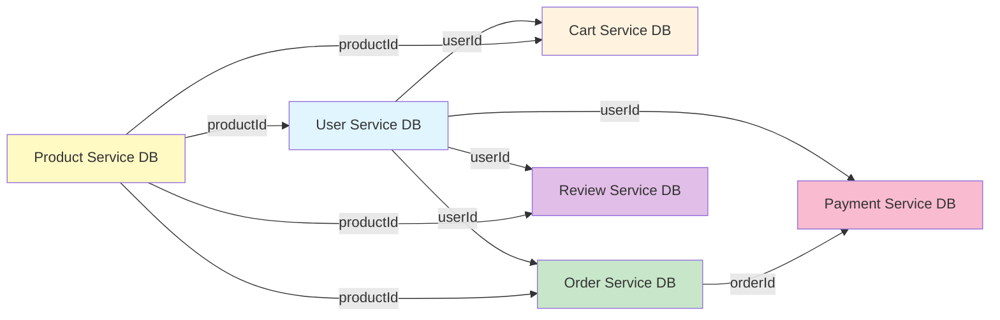
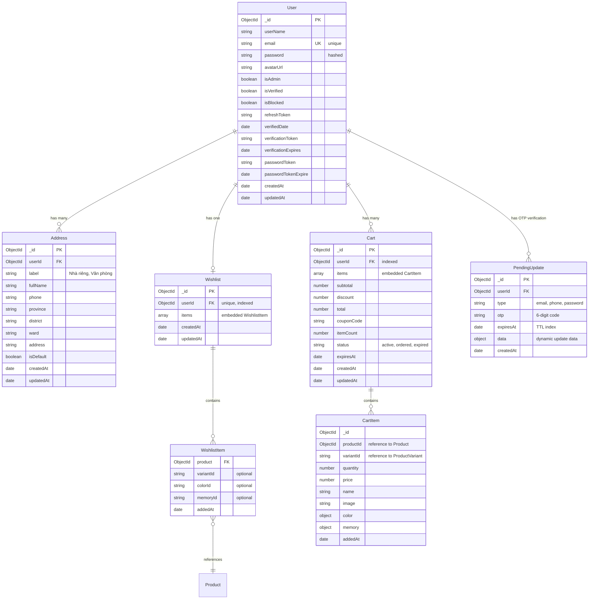
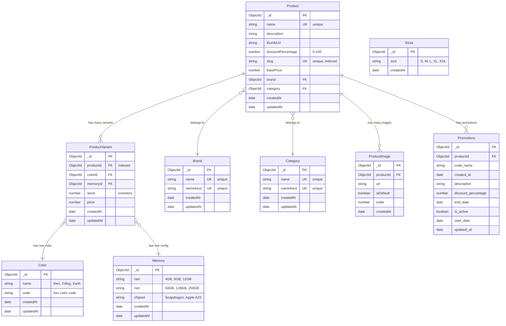
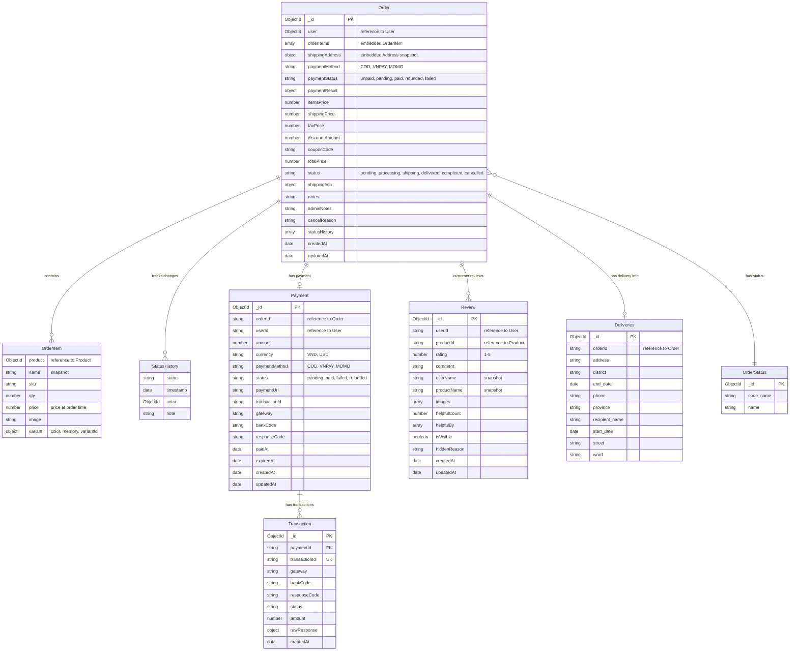
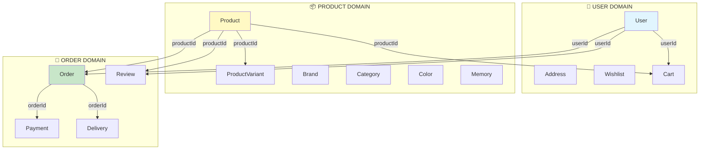
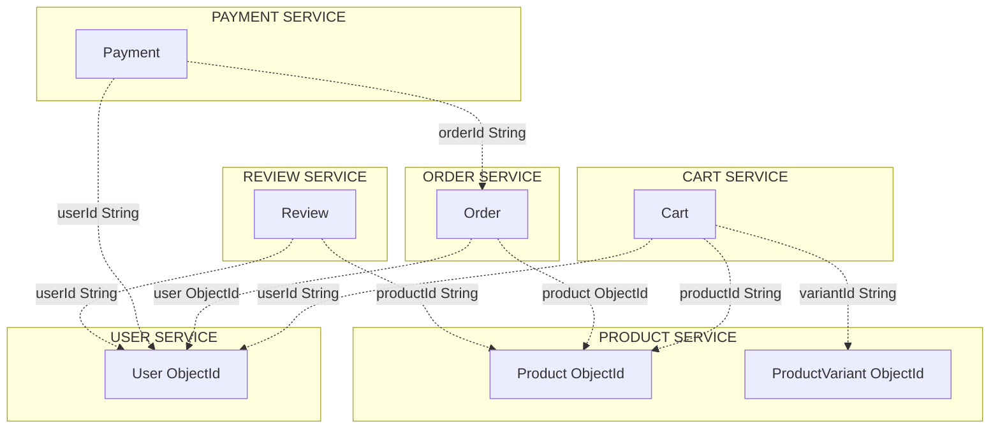

# 📊 SƠ ĐỒ ERD - SMARTBUY E-COMMERCE SYSTEM

> **Hệ thống quản lý bán hàng điện thoại trực tuyến - Kiến trúc Microservices**

---

## 🗂️ TỔNG QUAN CÁC DATABASE



---

## 📐 SƠ ĐỒ ERD CHI TIẾT - CHIA THEO DOMAIN

> MongoDB là NoSQL nên không có foreign key constraints thực sự, nhưng các collections liên kết với nhau thông qua **ObjectId references**. Dưới đây là sơ đồ ERD chia theo từng domain để dễ hiểu.

---

### 🔵 **3.2.1.1. Tài khoản người dùng - Địa chỉ - Giỏ hàng**



**Mô tả:** Domain này quản lý toàn bộ thông tin người dùng, địa chỉ giao hàng, danh sách yêu thích và giỏ hàng. User có thể có nhiều địa chỉ, một wishlist, và nhiều cart (nhưng chỉ 1 active cart).

---

### 🟢 **3.2.1.2. Sản phẩm - Danh mục - Thương hiệu**



**Mô tả:** Domain này quản lý tất cả thông tin sản phẩm, bao gồm danh mục, thương hiệu, màu sắc, cấu hình, ảnh và khuyến mãi. Mỗi Product có nhiều ProductVariant (biến thể), mỗi variant có color + memory riêng.

---

### 🟡 **3.2.1.3. Đơn hàng - Thanh toán - Đánh giá**



**Mô tả:** Domain này quản lý toàn bộ quy trình đặt hàng, từ tạo đơn, thanh toán, giao hàng đến đánh giá. Order chứa OrderItems (embedded), có Payment liên kết, và tracking qua StatusHistory.

---

## 📊 SƠ ĐỒ TỔNG QUAN - RELATIONSHIPS GIỮA CÁC DOMAIN



---

## 🔗 PHÂN NHÓM DATABASE THEO SERVICE

### 1️⃣ **USER SERVICE DATABASE**
**Collections:**
- ✅ `users` - Tài khoản người dùng
- ✅ `addresses` - Địa chỉ giao hàng
- ✅ `wishlists` - Danh sách yêu thích
- ✅ `pendingupdates` - OTP verification

**Relationships:**
```
User (1) ──→ (N) Address
User (1) ──→ (1) Wishlist
User (1) ──→ (N) PendingUpdate

Wishlist (1) ──→ (N) WishlistItem (embedded)
WishlistItem ──→ Product (reference - cross service)
```

**Indexes:**
- `users.email` (unique)
- `users.isAdmin` 
- `addresses.userId`
- `wishlists.userId` (unique)
- `pendingupdates.expiresAt` (TTL)

---

### 2️⃣ **PRODUCT SERVICE DATABASE**
**Collections:**
- ✅ `products` - Sản phẩm chính
- ✅ `productvariants` - Biến thể (màu + cấu hình)
- ✅ `brands` - Nhãn hiệu
- ✅ `categories` - Danh mục
- ✅ `colors` - Màu sắc
- ✅ `memories` - Cấu hình RAM/ROM
- ✅ `productimages` - Ảnh sản phẩm

**Relationships:**
```
Product (N) ──→ (1) Brand
Product (N) ──→ (1) Category
Product (1) ──→ (N) ProductVariant
Product (1) ──→ (N) ProductImage

ProductVariant (N) ──→ (1) Color
ProductVariant (N) ──→ (1) Memory
```

**Indexes:**
- `products.slug` (unique)
- `products.name` (unique)
- `products.brand`
- `products.category`
- `productvariants.productId`
- `brands.name` (unique)
- `categories.name` (unique)

---

### 3️⃣ **CART SERVICE DATABASE**
**Collections:**
- ✅ `carts` - Giỏ hàng

**Relationships:**
```
Cart (N) ──→ (1) User (reference - cross service)
Cart (1) ──→ (N) CartItem (embedded)

CartItem ──→ Product (reference - cross service)
CartItem ──→ ProductVariant (reference - cross service)
```

**Indexes:**
- `carts.userId` (unique for active status)
- `carts.status`
- `carts.expiresAt` (TTL)

**Embedded Structure:**
```javascript
{
  _id: ObjectId,
  userId: ObjectId,
  items: [
    {
      _id: ObjectId,
      productId: ObjectId,
      variantId: String,
      quantity: Number,
      price: Number,
      name: String,
      image: String,
      color: { name, code },
      memory: { ram, rom }
    }
  ],
  subtotal: Number,
  total: Number,
  status: "active"
}
```

---

### 4️⃣ **ORDER SERVICE DATABASE**
**Collections:**
- ✅ `orders` - Đơn hàng

**Relationships:**
```
Order (N) ──→ (1) User (reference - cross service)
Order (1) ──→ (N) OrderItem (embedded)
Order (1) ──→ (N) StatusHistory (embedded)

OrderItem ──→ Product (reference - cross service)
Order copies Address data (embedded snapshot)
```

**Indexes:**
- `orders.user`
- `orders.status`
- `orders.paymentStatus`
- `orders.createdAt`

**Embedded Structure:**
```javascript
{
  _id: ObjectId,
  user: ObjectId,
  orderItems: [
    {
      product: ObjectId,
      name: String,
      qty: Number,
      price: Number,
      image: String,
      variant: { color, memory, variantId }
    }
  ],
  shippingAddress: {
    fullName, phone, province, district, ward, address
  },
  paymentMethod: "COD" | "VNPAY",
  status: "pending",
  statusHistory: [
    { status, timestamp, actor, note }
  ]
}
```

---

### 5️⃣ **PAYMENT SERVICE DATABASE**
**Collections:**
- ✅ `payments` - Thanh toán
- ✅ `transactions` - Giao dịch chi tiết

**Relationships:**
```
Payment (1) ──→ (1) Order (reference - cross service via orderId string)
Payment (N) ──→ (1) User (reference - cross service via userId string)
Payment (1) ──→ (N) Transaction
```

**Indexes:**
- `payments.orderId`
- `payments.userId`
- `payments.paymentMethod`
- `payments.status`
- `transactions.transactionId` (unique)
- `transactions.paymentId`

---

### 6️⃣ **REVIEW SERVICE DATABASE**
**Collections:**
- ✅ `reviews` - Đánh giá sản phẩm

**Relationships:**
```
Review (N) ──→ (1) User (reference - cross service via userId string)
Review (N) ──→ (1) Product (reference - cross service via productId string)
```

**Indexes:**
- `reviews.productId` + `createdAt` (compound)
- `reviews.userId`
- `reviews.rating`
- `reviews.isVisible`

---

## 🔄 CROSS-SERVICE REFERENCES

### **String References (Microservices Communication)**



**Lý do dùng String thay vì ObjectId:**
- ✅ Services nằm ở databases khác nhau
- ✅ Không thể populate() cross-database
- ✅ Phải fetch qua REST API giữa các services
- ✅ Tránh tight coupling giữa services

---

## 📊 DATA FLOW CHÍNH

### **1. User Registration & Login**
```
User registers
→ Create User document
→ Send OTP (PendingUpdate document)
→ Verify OTP
→ Update User.isVerified = true
→ Generate JWT tokens
```

### **2. Shopping Cart Flow**
```
User browses products
→ Add to Cart (Cart + CartItem embedded)
→ Update quantity
→ Apply coupon (if any)
→ Calculate total
→ Proceed to checkout
```

### **3. Order & Payment Flow**
```
User submits order
→ Create Order from Cart items
→ Order.status = "pending"
→ Create Payment document
→ Redirect to payment gateway

Payment Success:
→ Payment gateway webhook
→ Update Payment.status = "paid"
→ Update Order.paymentStatus = "paid"
→ Update Order.status = "processing"
→ Reserve stock (ProductVariant.stock - qty)
→ Clear Cart items
→ Send email confirmation

Payment Failed:
→ Update Payment.status = "failed"
→ Update Order.status = "payment_failed"
→ Don't reserve stock
```

### **4. Order Processing Flow**
```
pending → confirmed (admin)
→ processing (preparing)
→ ready_to_ship (ready)
→ shipping (on delivery)
→ delivered (customer receives)
→ completed (customer confirms)

Each status change:
→ Add to Order.statusHistory[]
→ Send email/SMS notification
```

### **5. Review Flow**
```
Order.status = "completed"
→ User can write review
→ Create Review document
→ Upload images (optional)
→ Admin can hide/show reviews
→ Other users can like (helpfulCount++)
```

---

## 🎯 EMBEDDED vs REFERENCED

### **✅ EMBEDDED (Nhúng trong document)**
**Khi nào dùng:**
- Dữ liệu nhỏ, cố định
- Luôn query cùng parent
- Không cần query riêng
- One-to-few relationship

**Examples:**
```javascript
// Cart contains CartItems (embedded)
{
  _id: ObjectId("cart123"),
  userId: ObjectId("user456"),
  items: [
    { productId, quantity, price, name, image },
    { productId, quantity, price, name, image }
  ]
}

// Order contains OrderItems (embedded)
{
  _id: ObjectId("order789"),
  user: ObjectId("user456"),
  orderItems: [
    { product, name, qty, price, image }
  ],
  shippingAddress: { fullName, phone, address } // snapshot
}

// Wishlist contains WishlistItems (embedded)
{
  _id: ObjectId("wishlist999"),
  userId: ObjectId("user456"),
  items: [
    { product, variantId, addedAt }
  ]
}
```

### **✅ REFERENCED (Tham chiếu ObjectId)**
**Khi nào dùng:**
- Dữ liệu lớn, phức tạp
- Cần query riêng biệt
- Dùng chung nhiều nơi
- Tránh duplicate
- One-to-many, many-to-many

**Examples:**
```javascript
// Product references Brand
{
  _id: ObjectId("product123"),
  name: "iPhone 15 Pro Max",
  brand: ObjectId("brand456") // reference
}

// ProductVariant references Product, Color, Memory
{
  _id: ObjectId("variant789"),
  productId: ObjectId("product123"),
  colorId: ObjectId("color111"),
  memoryId: ObjectId("memory222"),
  stock: 50,
  price: 30000000
}

// Address references User
{
  _id: ObjectId("addr999"),
  userId: ObjectId("user456"),
  fullName: "Nguyễn Văn A",
  phone: "0909123456"
}
```

---

## 🚀 PERFORMANCE OPTIMIZATION

### **Indexes được tạo:**
```javascript
// User Service
users.email (unique)
users.isAdmin (boolean)
addresses.userId (reference)
wishlists.userId (unique)

// Product Service
products.slug (unique, text)
products.name (unique)
products.brand (reference)
products.category (reference)
productvariants.productId (reference)

// Cart Service
carts.userId (unique + status compound)
carts.status (enum)
carts.expiresAt (TTL index)

// Order Service
orders.user (reference)
orders.status (enum)
orders.paymentStatus (enum)
orders.createdAt (date, for sorting)

// Payment Service
payments.orderId (string reference)
payments.userId (string reference)
payments.status (enum)
transactions.transactionId (unique)

// Review Service
reviews.productId + createdAt (compound)
reviews.userId (string reference)
reviews.rating (number)
```

### **TTL Indexes (Auto-delete):**
```javascript
// Auto-delete expired OTP after 10 minutes
pendingupdates.expiresAt (TTL: 10 minutes)

// Auto-delete abandoned carts after 30 days
carts.expiresAt (TTL: 30 days for inactive)

// Auto-delete expired payment links after 15 minutes
payments.expiredAt (TTL: 15 minutes)
```

---

## 📝 NOTES & BEST PRACTICES

### ✅ **Schema Design Principles**
1. **Normalize when**: Dữ liệu dùng chung, thay đổi thường xuyên (Brand, Category, Color, Memory)
2. **Denormalize when**: Snapshot để giữ lịch sử (OrderItem, shippingAddress trong Order)
3. **Embed when**: One-to-few, luôn query cùng parent (CartItem, OrderItem)
4. **Reference when**: One-to-many, many-to-many, query riêng (Product → ProductVariant)

### ✅ **Data Consistency**
- **Order** snapshot shippingAddress để tránh thay đổi sau khi đặt
- **OrderItem** snapshot tên + giá sản phẩm tại thời điểm đặt
- **CartItem** lưu giá hiện tại, có thể outdate (recalculate khi checkout)
- **Review** snapshot userName, productName (tránh bị null khi xóa)

### ✅ **Cross-Service Communication**
- Dùng **String** thay vì ObjectId cho cross-service references
- Validate existence qua REST API calls giữa services
- Không dùng MongoDB populate() cross-database
- Cache frequently accessed data (Product details, User info)

### ✅ **Security**
- Hash passwords với bcrypt (User.password)
- Encrypt sensitive data (payment details, personal info)
- Validate user permissions (isAdmin, isVerified)
- Rate limit OTP requests (PendingUpdate)
- Sanitize user inputs (prevent NoSQL injection)

---

## 🛠️ TOOLS ĐỂ XEM SƠ ĐỒ

### **VS Code Extensions:**
1. **Markdown Preview Enhanced** - Xem mermaid diagrams
2. **Mermaid Preview** - Preview trực tiếp
3. **Draw.io Integration** - Export to PNG/SVG

### **Online Tools:**
1. **Mermaid Live Editor**: https://mermaid.live
2. **Draw.io**: https://app.diagrams.net
3. **Lucidchart**: https://www.lucidchart.com
4. **dbdiagram.io**: https://dbdiagram.io

### **Export Commands:**
```bash
# Install mermaid-cli
npm install -g @mermaid-js/mermaid-cli

# Convert to PNG
mmdc -i ERD_DIAGRAM.md -o erd.png

# Convert to SVG
mmdc -i ERD_DIAGRAM.md -o erd.svg
```

---

## 📚 REFERENCES

- MongoDB Schema Design: https://www.mongodb.com/docs/manual/data-modeling/
- Mermaid Syntax: https://mermaid.js.org/syntax/entityRelationshipDiagram.html
- Microservices Data Patterns: https://microservices.io/patterns/data/

---

**Last Updated:** December 14, 2025
**Version:** 1.0
**Author:** SmartBuy Development Team
