# 3.3. XÂY DỰNG CÁC DỊCH VỤ

## **Tổng quan kiến trúc**

Hệ thống SmartBuy được xây dựng theo kiến trúc Microservices với các dịch vụ độc lập, giao tiếp qua REST API thông qua API Gateway. Mỗi service có database MongoDB riêng biệt, đảm bảo tính độc lập và khả năng mở rộng.

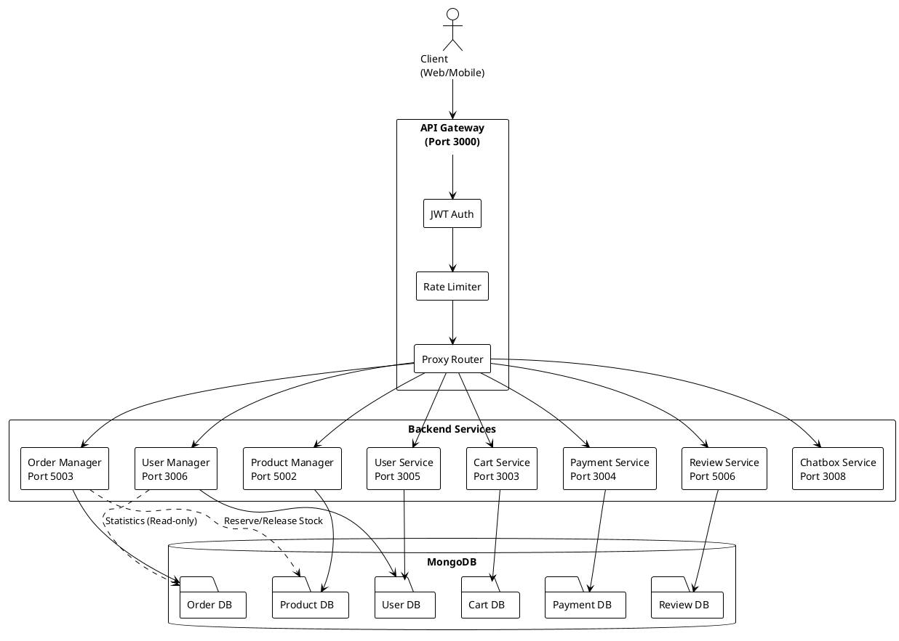

**Hình 3.X: Kiến trúc tổng quan hệ thống SmartBuy**

---

## 3.3.1. API Gateway

### 3.3.1.1. Tổng quan

#### a) Vấn đề

Trong kiến trúc microservices, hệ thống SmartBuy bao gồm 8 dịch vụ độc lập chạy trên các cổng khác nhau (3000-5006). Client cần gọi đến nhiều endpoint khác nhau, gây khó khăn trong việc quản lý và bảo mật. Mỗi service nếu tự xử lý authentication sẽ dẫn đến lặp code và khó đồng nhất. Ngoài ra, việc theo dõi request/response và xử lý CORS trở nên phức tạp khi phân tán.

#### b) Giải pháp

API Gateway được thiết kế như **điểm vào duy nhất** cho toàn bộ hệ thống, đóng vai trò trung gian giữa client và backend services. Gateway xử lý xác thực JWT tập trung, routing thông minh dựa trên URL pattern, rate limiting và CORS. Dịch vụ được xây dựng bằng **Express.js + TypeScript**, chạy trên cổng **3000**.

#### c) So sánh các giải pháp

**Bảng 3-X: So sánh các giải pháp triển khai API Gateway**

| Tiêu chí | Express.js (Custom) | Kong | Nginx | AWS API Gateway |
|----------|---------------------|------|-------|-----------------|
| Độ tùy biến | Rất cao | Cao | Trung bình | Thấp |
| Hiệu suất | Tốt | Rất tốt | Rất tốt | Tốt |
| Chi phí | Miễn phí | Miễn phí | Miễn phí | Tính phí |
| Tích hợp JWT | Tự code | Plugin | Module | Built-in |
| Phức tạp | Thấp | Trung bình | Trung bình | Thấp |
| Phù hợp | Vừa & nhỏ | Lớn | Vừa & lớn | Enterprise |

Với quy mô dự án và yêu cầu tùy biến cao, **Express.js Gateway** là lựa chọn phù hợp, cho phép kiểm soát toàn bộ logic routing và authentication.

---

### 3.3.1.2. Cách thức triển khai

#### a) Cơ chế routing thông minh

API Gateway sử dụng URL pattern matching để định tuyến các request đến đúng backend service. Cơ chế hoạt động dựa trên prefix của đường dẫn API, cho phép Gateway tự động xác định service đích và forward request tương ứng.

Các request liên quan đến **xác thực người dùng** (đăng ký, đăng nhập, OAuth) với pattern `/api/auth/*` được định tuyến đến **User Service** trên cổng **3005**. Đây là service chuyên xử lý authentication và authorization, cung cấp JWT token cho người dùng sau khi đăng nhập thành công.

Đối với **quản lý người dùng từ phía Admin**, các endpoint `/api/users/*` và `/api/addresses/*` được chuyển hướng đến **User Manager Service** (cổng **3006**). Service này cung cấp dashboard quản lý toàn diện cho Admin để CRUD users, quản lý địa chỉ giao hàng và phân khúc khách hàng.

**Quản lý sản phẩm** được tập trung tại **Product Manager Service** (cổng **5002**) với ba nhóm endpoint: `/api/products/*` cho CRUD sản phẩm và variants, `/api/categories/*` cho quản lý danh mục, và `/api/brands/*` cho quản lý thương hiệu. Tất cả các request liên quan đến sản phẩm đều được Gateway routing đến service này.

Luồng **đặt hàng và thanh toán** được phân tách rõ ràng: `/api/orders/*` định tuyến đến **Order Manager Service** (cổng **5003**) để xử lý đơn hàng, trong khi `/api/payments/*` được gửi đến **Payment Service** (cổng **3004**) để xử lý thanh toán qua VNPay hoặc COD. Gateway đảm bảo hai services này hoạt động độc lập nhưng vẫn đồng bộ thông qua API calls.

**Cart Service** (cổng **3003**) nhận các request từ `/api/cart/*` để quản lý giỏ hàng của người dùng. **Review Service** (cổng **5006**) xử lý các endpoint `/api/reviews/*` cho chức năng đánh giá sản phẩm. **Chatbox Service** (cổng **3008**) được gọi qua `/api/chatbox/*` để tích hợp Dialogflow chatbot, hỗ trợ khách hàng tìm kiếm và tư vấn sản phẩm.

Gateway sử dụng thư viện `http-proxy-middleware` của Express.js để thực hiện proxy requests, tự động rewrite URL và forward headers. Mỗi routing rule được cấu hình với target URL, path rewrite pattern và các middleware xử lý lỗi, đảm bảo tính ổn định khi một service bị lỗi hoặc timeout.

#### b) Cơ chế xác thực

Gateway sử dụng **JWT (JSON Web Token)** để xác thực người dùng:

1. **Public routes**: Không cần token (đăng ký, đăng nhập, xem sản phẩm)
2. **Protected routes**: Yêu cầu token hợp lệ (giỏ hàng, đơn hàng, đánh giá)
3. **Admin routes**: Yêu cầu token + quyền admin (quản lý users, sản phẩm, đơn hàng)

**Middleware authentication**:
- Lấy token từ header `Authorization: Bearer <token>`
- Verify token bằng `jwt.verify()` với secret key
- Giải mã payload: `{ userId, email, isAdmin }`
- Gắn thông tin user vào `req.user` để các service sử dụng

#### c) Luồng xử lý request

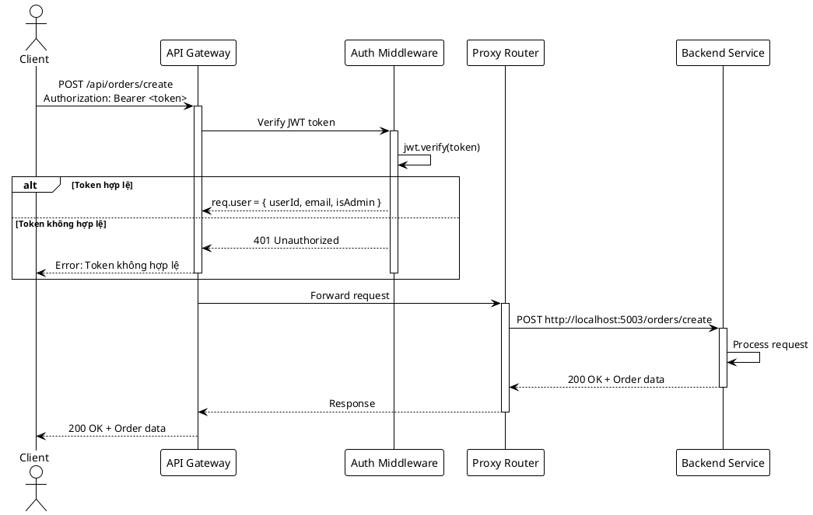

**Hình 3.X: Luồng xử lý request qua API Gateway**

#### d) Công nghệ sử dụng

- **Express.js + TypeScript**: Web framework với type safety
- **jsonwebtoken**: Xác thực JWT
- **axios**: HTTP client để gọi backend services
- **helmet**: Security headers (XSS, CSRF protection)
- **express-rate-limit**: Giới hạn 100 requests/phút/IP
- **cors**: Cho phép cross-origin từ frontend (port 5173)
- **morgan**: HTTP request logger

---

## 3.3.2. User Manager Service

### 3.3.2.1. Tổng quan

User Manager Service quản lý thông tin người dùng và địa chỉ giao hàng, chạy trên cổng **3006** với database **usermanagerDB**. Dịch vụ này phục vụ Admin dashboard để quản lý users, phân khúc khách hàng và thống kê hoạt động.

**Chức năng chính:**
- Quản lý users: CRUD, khóa/mở tài khoản, cấp quyền admin
- Quản lý địa chỉ giao hàng của users
- Phân khúc khách hàng (VIP, Thường xuyên, Mới)
- Thống kê: tổng users, users mới, khách VIP
- Tích hợp cross-database với Order DB để tính chi tiêu

**Công nghệ:**
- **Node.js + Express.js**: Backend framework
- **MongoDB + Mongoose**: Database với 2 collections (users, addresses)
- **Bcrypt**: Mã hóa mật khẩu
- Cross-database connection: User DB ↔ Order DB

### 3.3.2.2. API Endpoints

| Nhóm chức năng | Method | Endpoint | Mô tả |
|---|---|---|---|
| **Quản lý Users** | GET | `/users` | Danh sách users (phân trang, tìm kiếm) |
| | GET | `/users/:id` | Chi tiết user theo ID |
| | POST | `/users` | Tạo user mới |
| | PUT | `/users/:id` | Cập nhật thông tin user |
| | DELETE | `/users/:id` | Xóa user |
| | PUT | `/users/:id/role` | Cấp quyền admin |
| | PUT | `/users/:id/activate` | Kích hoạt tài khoản |
| | PUT | `/users/:id/deactivate` | Khóa tài khoản |
| **Quản lý Địa chỉ** | GET | `/users/:userId/addresses` | Danh sách địa chỉ của user |
| | GET | `/addresses/:id` | Chi tiết địa chỉ |
| | POST | `/addresses` | Thêm địa chỉ mới |
| | PUT | `/addresses/:id` | Cập nhật địa chỉ |
| | DELETE | `/addresses/:id` | Xóa địa chỉ |
| | PUT | `/addresses/:id/default` | Đặt địa chỉ mặc định |
| **Thống kê** | GET | `/stats` | Tổng quan: tổng users, users mới, VIP |
| | GET | `/stats/segments` | Phân khúc khách hàng (VIP/Thường/Mới) |
| | GET | `/stats/monthly-growth` | Tăng trưởng theo tháng |

### 3.3.2.3. Cách thức triển khai

#### a) Quản lý danh sách người dùng

Trang quản lý người dùng hiển thị bảng tổng quan với KPI (tổng users, users mới, VIP) và biểu đồ phân bổ theo vai trò. Danh sách users dạng bảng có các cột: checkbox, avatar, email, vai trò, trạng thái tài khoản, trạng thái xác thực, ngày đăng ký và các nút hành động. Hệ thống hỗ trợ phân trang 10 users/trang, tìm kiếm theo email/tên và lọc theo trạng thái/vai trò. Admin có thể kết hợp nhiều tiêu chí lọc để thu hẹp kết quả.

#### b) Thêm và chỉnh sửa tài khoản

Admin tạo tài khoản mới qua nút "Thêm người dùng", modal yêu cầu nhập: tên người dùng, email (validate định dạng), mật khẩu (tối thiểu 6 ký tự) và checkbox cấp quyền admin. Hệ thống kiểm tra email chưa tồn tại và validate dữ liệu, hiển thị lỗi chi tiết nếu vi phạm. Mật khẩu được mã hóa bằng bcrypt trước khi lưu database.

Chỉnh sửa tài khoản cho phép Admin cập nhật thông tin: modal hiển thị các trường được điền sẵn (tên, email không cho sửa, mật khẩu mới tùy chọn, checkbox admin/khóa tài khoản/xác thực). Admin cập nhật bất kỳ trường nào, mật khẩu để trống sẽ giữ nguyên. Sau khi lưu, danh sách tự động refresh.

#### c) Khóa/mở khóa và phân quyền tài khoản

Hệ thống cung cấp hai cách quản lý: thao tác đơn lẻ (nút "Khóa/Mở khóa" thay đổi trạng thái ngay lập tức, nút "Cấp/Gỡ quyền Admin" thay đổi vai trò) và thao tác hàng loạt.

Thao tác hàng loạt cho phép chọn nhiều users bằng checkbox, sau đó áp dụng hành động: Khóa/Mở khóa/Cấp quyền Admin/Xóa. Trước khi thực hiện, modal xác nhận hiển thị số lượng tài khoản bị ảnh hưởng để tránh nhầm lẫn.

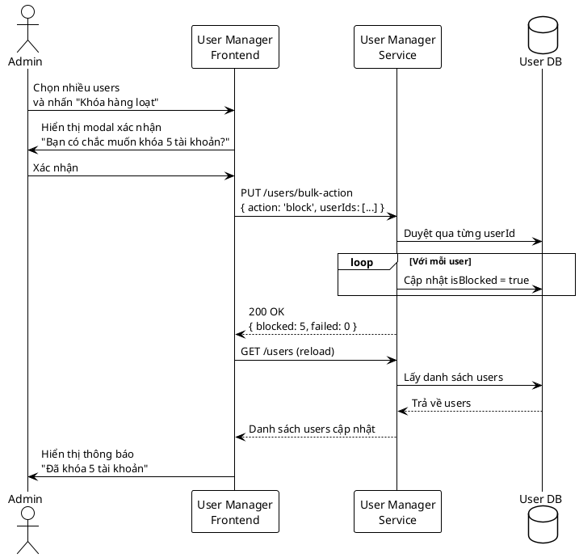

**Hình 3.X: Sơ đồ hoạt động khóa tài khoản hàng loạt**

#### d) Quản lý địa chỉ giao hàng

Admin quản lý địa chỉ giao hàng qua nút "Quản lý địa chỉ", modal hiển thị danh sách địa chỉ với thông tin: nhãn (Nhà riêng/Văn phòng/Khác), tên người nhận, số điện thoại, địa chỉ đầy đủ và trạng thái mặc định.

Admin thêm địa chỉ mới qua nút "Thêm địa chỉ", form yêu cầu: nhãn (dropdown), tên người nhận, số điện thoại (validate 10-11 số), tỉnh/quận/phường, số nhà đường và checkbox mặc định. Hệ thống kiểm tra tính hợp lệ trước khi lưu.

Chỉnh sửa địa chỉ hiển thị form với dữ liệu điền sẵn để Admin cập nhật. Xóa địa chỉ yêu cầu xác nhận. Nút "Đặt làm mặc định" tự động bỏ cờ mặc định ở các địa chỉ khác, đảm bảo chỉ có một địa chỉ mặc định.

#### c) Phân khúc khách hàng (Customer Segmentation)

Hệ thống tự động phân loại users thành 3 nhóm dựa trên hành vi mua hàng (sử dụng cross-database connection để truy vấn Order DB):

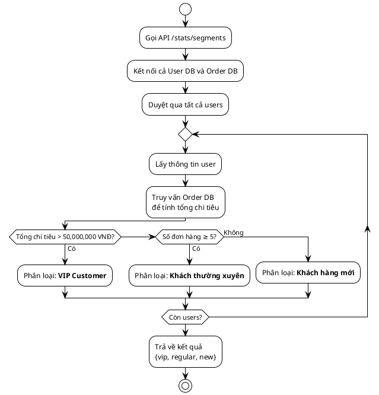

**Tiêu chí phân khúc:**
- **VIP Customer**: Tổng chi tiêu > 50 triệu VNĐ
- **Khách thường xuyên**: Có ≥ 5 đơn hàng hoàn thành
- **Khách hàng mới**: Còn lại

### 3.3.2.4. Database Collections

| Collection | Mô tả | Fields chính |
|---|---|---|
| **users** | Thông tin người dùng | email, password (bcrypt), username, isAdmin, avatar, createdAt |
| **addresses** | Địa chỉ giao hàng | userId, recipientName, phoneNumber, province, district, ward, street, isDefault |

**Indexes:** userId (addresses), email (users)

---

## 3.3.3. Product Manager Service

### 3.3.3.1. Tổng quan

Product Manager Service quản lý toàn bộ danh mục sản phẩm điện thoại với cấu trúc **3 cấp** (Product → Variant → Image), chạy trên cổng **5002** với database **productmanagerDB** gồm **9 collections**.

**Cấu trúc 3 cấp:**
1. **Product**: Thông tin chung (name, description, brand, category)
2. **Product Variant**: Biến thể theo màu sắc + bộ nhớ (stock, sold, price)
3. **Product Image**: Hình ảnh cho từng variant

**Chức năng chính:**
- CRUD sản phẩm, variants, images (Admin)
- Tìm kiếm, lọc, phân trang sản phẩm
- Reserve/Release stock (tích hợp với Order Service)
- Quản lý brands, categories, colors, memories
- Thống kê sản phẩm bán chạy
- Tích hợp Chatbox search

**9 Collections:** products, productVariants, productImages, productSpecifications, brands, categories, colors, memories, chatSearches

### 3.3.3.2. API Endpoints

| Nhóm chức năng | Method | Endpoint | Mô tả |
|---|---|---|---|
| **Products** | GET | `/products` | Danh sách sản phẩm (filter, sort, pagination) |
| | GET | `/products/:id` | Chi tiết sản phẩm |
| | POST | `/products` | Tạo sản phẩm mới (Admin) |
| | PUT | `/products/:id` | Cập nhật sản phẩm (Admin) |
| | DELETE | `/products/:id` | Xóa sản phẩm (Admin) |
| **Variants** | GET | `/products/:id/variants` | Variants của sản phẩm |
| | POST | `/variants` | Thêm variant (Admin) |
| | PUT | `/variants/:id` | Cập nhật variant (Admin) |
| | DELETE | `/variants/:id` | Xóa variant (Admin) |
| | POST | `/variants/reserve` | Đặt giữ stock (Order Service) |
| | POST | `/variants/release` | Giải phóng stock (Order Service) |
| **Images** | GET | `/products/:id/images` | Hình ảnh sản phẩm |
| | POST | `/images/upload` | Upload hình (Admin) |
| | DELETE | `/images/:id` | Xóa hình (Admin) |
| **Brands** | GET | `/brands` | Danh sách thương hiệu |
| | POST | `/brands` | Thêm brand (Admin) |
| | PUT | `/brands/:id` | Cập nhật brand (Admin) |
| **Categories** | GET | `/categories` | Danh sách danh mục |
| | POST | `/categories` | Thêm category (Admin) |
| **Colors/Memories** | GET | `/colors` | Danh sách màu sắc |
| | GET | `/memories` | Danh sách bộ nhớ |
| **Chatbox** | POST | `/chatbox-search` | Lưu lịch sử tìm kiếm chatbox |
| **Thống kê** | GET | `/stats/top-products` | Top sản phẩm bán chạy |
| | GET | `/stats/stock-alert` | Sản phẩm sắp hết hàng |

### 3.3.3.3. Cách thức triển khai

#### a) Quản lý sản phẩm với cấu trúc 3 cấp

Trang quản lý sản phẩm sử dụng giao diện tab: Sản phẩm (CRUD sản phẩm và variants), Danh mục, Thương hiệu, Màu sắc, Bộ nhớ (RAM/ROM) và Thuộc tính kỹ thuật. Thiết kế tab giúp chuyển đổi nhanh không cần load lại trang.

Tab sản phẩm hiển thị danh sách với: thumbnail, tên, thương hiệu, danh mục, giá, trạng thái tồn kho (tính từ tổng stock các variants), ngày tạo và các nút hành động.

Hỗ trợ tìm kiếm theo tên, lọc theo tồn kho/thương hiệu/danh mục và sắp xếp theo giá. Admin kết hợp nhiều tiêu chí để thu hẹp kết quả.

#### b) Thêm sản phẩm mới theo quy trình 2 bước

**Bước 1**: Admin mở modal "Thêm sản phẩm", nhập tên (3-200 ký tự), chọn danh mục/thương hiệu từ dropdown, nhập giá cơ bản, giảm giá (0-100%) và upload thumbnail (jpg/png, max 5MB). Hệ thống validate dữ liệu và hiển thị lỗi nếu vi phạm.

**Bước 2**: Sau khi validate bước 1, modal chuyển sang tạo variant. Admin chọn bộ nhớ (256GB/512GB...), màu sắc, nhập giá variant và số lượng tồn kho ban đầu.

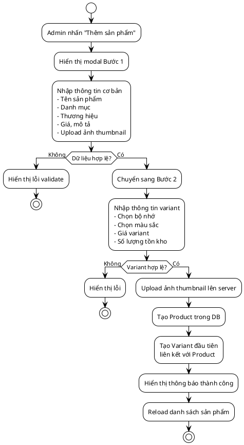

**Hình 3.X: Sơ đồ hoạt động thêm sản phẩm mới**

Khi nhấn "Tạo sản phẩm", hệ thống upload ảnh lên `/uploads/products/thumbs/`, tạo Product với slug tự động ("iPhone 15 Pro" → "iphone-15-pro"), tạo Variant đầu tiên liên kết qua `productId`, sau đó reload danh sách.

#### c) Quản lý variants và tồn kho

Trang `/admin/product-detail/[id]` hiển thị bảng variants với các cột: màu sắc (hex), bộ nhớ, giá, tồn kho, đã bán và nút Sửa/Xóa. Admin thêm variant mới qua form chọn màu/bộ nhớ/giá/số lượng. Hệ thống kiểm tra không cho tạo trùng variant (cùng màu và bộ nhớ). Cập nhật tồn kho qua modal "Sửa", Admin điều chỉnh số lượng để đồng bộ với kho thực tế.

#### d) Quản lý các thuộc tính bổ trợ (Brands, Categories, Colors, Memories)
Các tab Brands/Categories/Colors/Memories cung cấp CRUD đầy đủ với tìm kiếm, thêm mới, sửa và xóa. 
Tab **Thương hiệu**: thêm brand với tên/mô tả, hiển thị danh sách với số lượng sản phẩm. Hệ thống cảnh báo khi xóa brand đang được sử dụng.
Tab **Danh mục**: quản lý categories với tên, slug (tự động/nhập tay) và mô tả. Hiện tại sử dụng cấu trúc phẳng.
Tab **Màu sắc**: quản lý colors với tên và mã hex. Giao diện preview màu theo mã hex. Thêm mới qua color picker hoặc nhập hex trực tiếp.
Tab **Bộ nhớ**: quản lý RAM/ROM, hiển thị format "RAM + ROM" (8GB + 256GB). Hỗ trợ thêm/sửa/xóa.
Tab **Thuộc tính kỹ thuật**: quản lý các danh sách các thông số kỹ thuật của sản phẩm.
Tất cả tab hỗ trợ **xóa hàng loạt**: tick checkbox nhiều items, xác nhận qua modal. Hệ thống báo lỗi nếu item đang được sử dụng và liệt kê các sản phẩm liên quan.

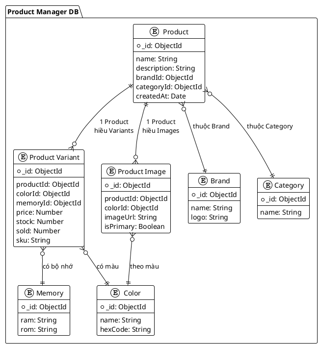

**Ví dụ:** iPhone 15 Pro (Product) → Có 3 variants: 256GB Titan Đen / 512GB Titan Trắng / 1TB Titan Xanh → Mỗi variant có 4-5 hình ảnh theo màu.

#### e) Tích hợp Reserve/Release Stock với Order Service

Hệ thống sử dụng cơ chế Reserve/Release stock để quản lý tồn kho theo thời gian thực và tránh overselling. Khi đặt hàng, Order Service gọi `POST /variants/reserve` với `variantId` và `quantity`. Product Service kiểm tra stock, nếu đủ thì trừ `stock -= quantity`, nếu không đủ thì trả lỗi 400.

Đơn hàng hoàn thành: tăng `sold += quantity` cho thống kê. Đơn hủy: gọi `POST /variants/release` để hoàn trả `stock += quantity` và giảm `sold -= quantity`, đảm bảo tồn kho không bị "khóa" vĩnh viễn.

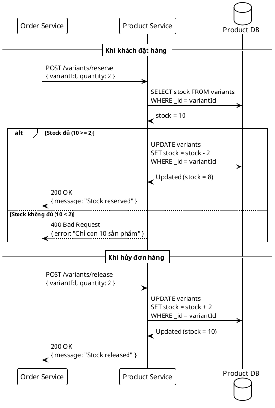

**Hình 3.X: Sơ đồ hoạt động Reserve/Release Stock**

### 3.3.3.4. Database Collections

| Collection | Số lượng records | Mô tả |
|---|---|---|
| products | ~100 | Sản phẩm chính |
| productVariants | ~500 | Biến thể theo màu + bộ nhớ |
| productImages | ~2000 | Hình ảnh sản phẩm |
| brands | ~15 | Apple, Samsung, Xiaomi... |
| categories | ~5 | Smartphone, Tablet, Phụ kiện... |
| colors | ~10 | Đen, Trắng, Xanh... |
| memories | ~8 | 128GB, 256GB, 512GB... |
| productSpecifications | ~100 | Thông số kỹ thuật |
| chatSearches | Động | Lịch sử tìm kiếm chatbox |

---

## 3.3.4. Order Manager Service

### 3.3.4.1. Tổng quan

Order Manager Service quản lý quy trình đặt hàng với **11 trạng thái** và tích hợp với Product Service (reserve/release stock) + Email Service (gửi thông báo). Dịch vụ chạy trên cổng **5003** với database **ordermanagerDB**.

**11 trạng thái đơn hàng:**
1. **pending_payment**: Chờ thanh toán
2. **paid**: Đã thanh toán
3. **processing**: Đang xử lý
4. **packing**: Đang đóng gói
5. **ready_to_ship**: Sẵn sàng giao
6. **shipping**: Đang giao hàng
7. **delivered**: Đã giao hàng
8. **completed**: Hoàn thành
9. **cancelled**: Đã hủy
10. **refund_requested**: Yêu cầu hoàn tiền
11. **refunded**: Đã hoàn tiền

**Chức năng chính:**
- Tạo đơn hàng (reserve stock từ Product Service)
- Cập nhật trạng thái đơn hàng (gửi email mỗi lần thay đổi)
- Hủy đơn hàng (release stock về Product Service)
- Quản lý đơn hàng (Admin: xem tất cả, User: xem của mình)
- Thống kê: doanh thu, AOV, peak hours, top products

### 3.3.4.2. API Endpoints

| Nhóm chức năng | Method | Endpoint | Mô tả |
|---|---|---|---|
| **Quản lý Orders** | GET | `/orders` | Danh sách đơn hàng (Admin: all, User: own) |
| | GET | `/orders/:id` | Chi tiết đơn hàng |
| | POST | `/orders` | Tạo đơn hàng mới |
| | PUT | `/orders/:id/status` | Cập nhật trạng thái (Admin) |
| | PUT | `/orders/:id/cancel` | Hủy đơn hàng |
| **Thống kê** | GET | `/stats/revenue` | Doanh thu theo thời gian |
| | GET | `/stats/aov` | Average Order Value |
| | GET | `/stats/peak-hours` | Giờ đặt hàng nhiều nhất |
| | GET | `/stats/top-products` | Sản phẩm bán chạy nhất |
| | GET | `/stats/order-status` | Phân bố trạng thái đơn hàng |

### 3.3.4.3. Cách thức triển khai

#### a) Trang tổng quan và thống kê đơn hàng

Trang quản lý hiển thị KPI cards: tổng đơn, doanh thu, AOV, đơn đang xử lý và tỷ lệ hủy đơn.

Hai biểu đồ chính: **Revenue Chart** (Line) hiển thị doanh thu 7 ngày gần nhất, **Status Chart** (Bar) hiển thị phân bổ đơn theo trạng thái. Dữ liệu từ API `GET /stats`, vẽ bằng Chart.js và tự động cập nhật.

#### b) Quản lý danh sách đơn hàng

Danh sách đơn dạng bảng: checkbox, mã đơn (ORD-20240101-001), khách hàng, số điện thoại, tổng giá, trạng thái đơn/thanh toán, phương thức (COD/VNPay), ngày tạo và nút hành động. Hỗ trợ tìm theo mã đơn/tên, lọc theo trạng thái đơn/thanh toán và khoảng thời gian. 11 trạng thái hiển thị với màu sắc riêng (Chờ thanh toán-tím, Đang giao-cam, Hoàn thành-xanh lá, Đã hủy-đỏ...).

#### c) Xem chi tiết và cập nhật trạng thái đơn hàng

Modal chi tiết hiển thị 4 phần: **Thông tin đơn** (mã, ngày tạo, khách hàng, trạng thái), **Địa chỉ giao** (người nhận, số điện thoại, địa chỉ đầy đủ), **Danh sách sản phẩm** (bảng với hình, tên, màu, bộ nhớ, giá, số lượng, tổng tiền) và **Lịch sử trạng thái** (timeline với timestamp, trạng thái, ghi chú).

Cập nhật trạng thái: modal chọn trạng thái mới (theo workflow) và nhập ghi chú. Hệ thống validate để tránh nhảy cóc trạng thái.

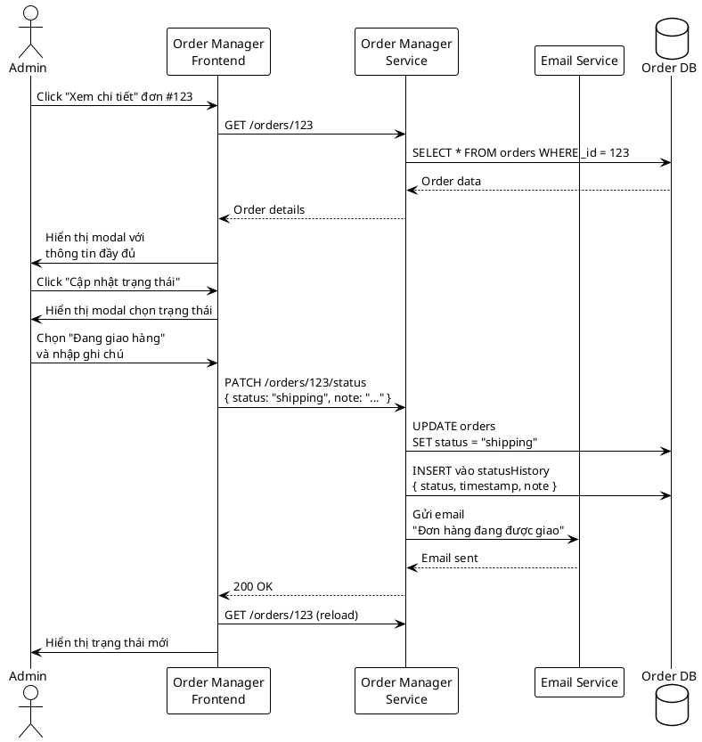

**Hình 3.X: Sơ đồ hoạt động cập nhật trạng thái đơn hàng**

Mỗi lần thay đổi trạng thái, hệ thống tự động gửi email thông báo cho khách với template tương ứng.

#### d) Hủy đơn hàng

Hủy đơn chỉ áp dụng cho các trạng thái: Chờ thanh toán/Chờ xác nhận/Đã xác nhận/Đang chuẩn bị. Admin nhập lý do hủy (bắt buộc), sau đó hệ thống thực hiện:

1. Cập nhật trạng thái đơn hàng sang "Đã hủy" với lý do hủy được lưu vào ghi chú.
2. Gọi Product Service API `/variants/release` để hoàn trả tồn kho cho tất cả sản phẩm trong đơn.
3. Nếu đơn đã thanh toán qua VNPay, khởi tạo quy trình hoàn tiền (update paymentStatus sang "refunded").
4. Gửi email thông báo hủy đơn cho khách hàng với nội dung lý do hủy và hướng dẫn (hoàn tiền nếu đã thanh toán, đặt lại đơn mới nếu muốn).
5. Reload danh sách đơn hàng để cập nhật trạng thái.

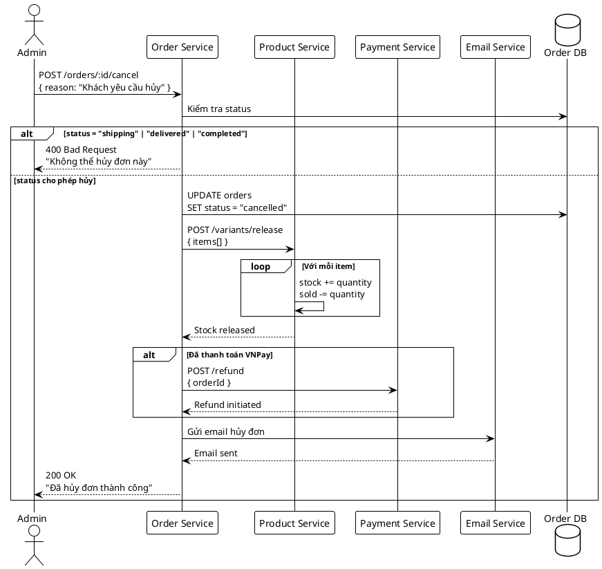

**Hình 3.X: Sơ đồ hoạt động hủy đơn hàng**

Cơ chế hoàn trả tồn kho rất quan trọng để đảm bảo các sản phẩm trong đơn bị hủy có thể được bán lại cho khách hàng khác. Nếu không hoàn trả, tồn kho sẽ bị "khóa" vĩnh viễn dù thực tế sản phẩm vẫn còn trong kho.

### 3.3.4.4. Database Collections

| Collection | Mô tả | Fields chính |
|---|---|---|
| **orders** | Đơn hàng | userId, items[], totalAmount, shippingAddress, status, paymentMethod, createdAt |
| **orderItems** (embedded) | Sản phẩm trong đơn | productId, variantId, quantity, price |

**Indexes:** userId, status, createdAt

---

### 3.3.4.4. Database Collections

| Collection | Mô tả | Fields chính |
|---|---|---|
| **orders** | Đơn hàng | orderId (mã đơn), userId, items[] (embedded), totalAmount, shippingAddress (embedded), orderStatus, paymentStatus, paymentMethod, createdAt |
| **orderItems** (embedded) | Sản phẩm trong đơn | productId, variantId, productName, variantInfo (color, memory), price, quantity, subtotal |
| **statusHistory** (embedded) | Lịch sử trạng thái | status, timestamp, note, updatedBy |

**Indexes:** orderId (unique), userId, orderStatus, paymentStatus, createdAt

---

## 3.3.5. Review Service

### 3.3.5.1. Tổng quan

Review Service quản lý đánh giá sản phẩm từ khách hàng, cho phép Admin kiểm duyệt nội dung, phản hồi đánh giá và thống kê chất lượng sản phẩm. Dịch vụ chạy trên cổng **5006** với database **reviewDB**, cung cấp dashboard trực quan để Admin giám sát và quản lý toàn bộ đánh giá trong hệ thống.

**Chức năng chính:**
- Xem danh sách đánh giá với thống kê tổng quan (KPI cards)
- Tìm kiếm và lọc đánh giá theo rating, trạng thái hiển thị
- Xem chi tiết đánh giá với ảnh đính kèm
- Phản hồi đánh giá (Admin Reply)
- Ẩn/hiện đánh giá (Content Moderation)
- Xóa đánh giá vi phạm chính sách
- Thống kê: tổng đánh giá, đánh giá trung bình, phân bổ visible/hidden

**Công nghệ:**
- **Node.js + Express.js**: Backend framework
- **MongoDB + Mongoose**: Database với 1 collection (reviews)
- **Vue.js 3 + TypeScript**: Admin frontend
- **TailwindCSS**: UI styling

### 3.3.5.2. API Endpoints

| Nhóm chức năng | Method | Endpoint | Mô tả |
|---|---|---|---|
| **Quản lý Reviews** | GET | `/reviews` | Danh sách đánh giá (filter, pagination) |
| | GET | `/reviews/:id` | Chi tiết đánh giá |
| | POST | `/reviews` | Tạo đánh giá mới (Customer) |
| | PUT | `/reviews/:id` | Cập nhật đánh giá |
| | DELETE | `/reviews/:id` | Xóa đánh giá (Admin) |
| **Visibility** | PUT | `/reviews/:id/visibility` | Ẩn/hiện đánh giá (Admin) |
| **Admin Reply** | POST | `/reviews/:id/reply` | Phản hồi đánh giá (Admin) |
| **Thống kê** | GET | `/reviews/stats` | Thống kê tổng quan |
| | GET | `/reviews/stats/visibility` | Phân bổ visible/hidden |
| **Product Reviews** | GET | `/reviews/product/:productId` | Đánh giá của sản phẩm |

### 3.3.5.3. Cách thức triển khai

#### a) Dashboard thống kê và KPI

Trang quản lý đánh giá hiển thị 4 chỉ số quan trọng thông qua KPI cards: tổng số đánh giá trong hệ thống (icon ngôi sao vàng), số đánh giá đang hiển thị cho người dùng (icon check màu xanh), số đánh giá đã bị ẩn bởi Admin (icon eye-off màu đỏ) và đánh giá trung bình của toàn bộ sản phẩm (icon star màu xanh). Khi Admin truy cập trang, hệ thống gọi hai API song song: `GET /reviews/stats` để lấy thống kê tổng quan (COUNT tổng reviews, AVG rating, SUM totalHelpful) và `GET /reviews/stats/visibility` để đếm số lượng đánh giá visible/hidden. Các KPI cards này được refresh tự động sau mỗi thao tác ẩn/hiện/xóa đánh giá để đảm bảo số liệu luôn chính xác và phản ánh trạng thái thực tế của hệ thống.

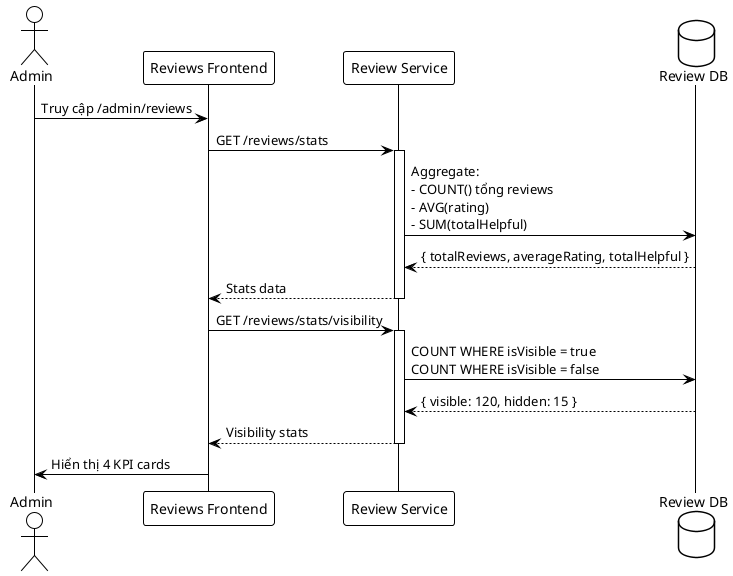

**Hình 3.X: Luồng tải thống kê dashboard đánh giá**

#### b) Tìm kiếm và lọc đánh giá

Hệ thống cung cấp ba cơ chế lọc đánh giá có thể kết hợp với nhau. Thanh tìm kiếm văn bản cho phép Admin tìm theo tên khách hàng, tên sản phẩm hoặc nội dung đánh giá, sử dụng debounce 300ms để giảm số lượng API calls khi user đang gõ. Dropdown lọc theo Rating cho phép chọn số sao từ 1 đến 5, chọn lại rating đã chọn sẽ bỏ filter. Dropdown lọc theo Visibility có hai options: "Đang hiển thị" (isVisible = true) và "Đã ẩn" (isVisible = false). Nút "Đặt lại bộ lọc" xóa tất cả filter và search term, trả về trạng thái mặc định hiển thị toàn bộ đánh giá. Backend xử lý query MongoDB với điều kiện $and kết hợp full-text search, rating và visibility, sau đó trả về kết quả phân trang. Admin có thể kết hợp các tiêu chí để thu hẹp kết quả, ví dụ tìm đánh giá 5 sao đã bị ẩn về sản phẩm iPhone.

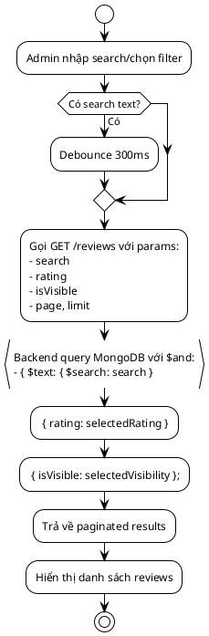

**Hình 3.X: Cơ chế tìm kiếm và lọc đánh giá**

#### c) Danh sách và chi tiết đánh giá

Danh sách đánh giá hiển thị dạng bảng với các cột: Rating (5 ngôi sao với số sao được chọn tô vàng), Avatar và tên người dùng, tên sản phẩm được đánh giá, preview 100 ký tự đầu của nội dung, ngày tạo định dạng dd/mm/yyyy hh:mm, badge trạng thái "Đang hiển thị" (xanh) hoặc "Đã ẩn" (đỏ), và ba nút hành động (Xem chi tiết, Ẩn/Hiện, Xóa). Khi Admin nhấn nút "Xem chi tiết", modal full-screen mở ra hiển thị đầy đủ thông tin người dùng (avatar, tên, ngày đánh giá), thông tin sản phẩm (tên, variant với màu sắc và bộ nhớ), rating với 5 ngôi sao, nội dung đánh giá không bị cắt, hình ảnh đính kèm hiển thị dạng grid, trạng thái hiển thị/ẩn kèm lý do ẩn nếu có, phản hồi từ Admin nếu đã có, và form textarea cho phép Admin gửi phản hồi mới hoặc chỉnh sửa phản hồi cũ.

#### d) Phản hồi đánh giá từ Admin

Chức năng Admin Reply cho phép Admin phản hồi trực tiếp đánh giá của khách hàng để giải đáp thắc mắc hoặc cảm ơn feedback tích cực. Sau khi mở modal chi tiết, Admin cuộn xuống phần "Admin Reply", nhập nội dung vào textarea và nhấn "Gửi phản hồi". Hệ thống gọi `POST /reviews/:id/reply` với payload chứa adminReply và adminId, backend cập nhật các field adminReply, adminReplyAt và adminId trong MongoDB, sau đó trả về kết quả thành công. Modal tự đóng, toast notification hiển thị "Phản hồi thành công!", và danh sách đánh giá được refresh để hiển thị phản hồi mới. Admin có thể chỉnh sửa phản hồi bằng cách nhập nội dung mới và gửi lại, hệ thống sẽ ghi đè phản hồi cũ.

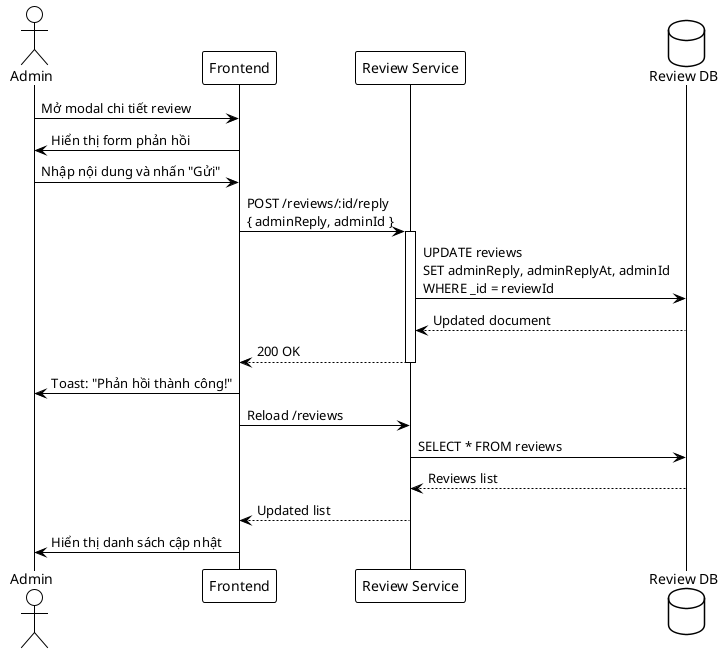

**Hình 3.X: Luồng phản hồi đánh giá**

#### e) Kiểm duyệt nội dung (Content Moderation)

Hệ thống cho phép Admin kiểm duyệt đánh giá không phù hợp thông qua hai thao tác: ẩn và hiện lại. Khi phát hiện đánh giá vi phạm (spam, từ ngữ thô tục, nội dung không liên quan), Admin nhấn nút "Ẩn", modal yêu cầu nhập lý do ẩn vào textarea bắt buộc, sau đó nhấn "Xác nhận". Hệ thống gọi `PUT /reviews/:id/visibility` với isVisible = false, hiddenReason và adminId, backend cập nhật các field tương ứng cùng với hiddenAt timestamp, làm cho đánh giá biến mất khỏi danh sách hiển thị trên trang sản phẩm cho khách hàng. Nếu sau khi kiểm tra lại Admin thấy đánh giá hợp lệ, Admin có thể lọc danh sách theo "Đã ẩn", nhấn nút "Hiện" trên đánh giá cần khôi phục, xác nhận qua modal, hệ thống gọi API với isVisible = true để cập nhật và xóa hiddenReason, khiến đánh giá xuất hiện lại trên trang sản phẩm. Lý do ẩn được lưu vào database để admin khác có thể xem lại khi cần thiết, đảm bảo tính minh bạch trong quá trình kiểm duyệt.

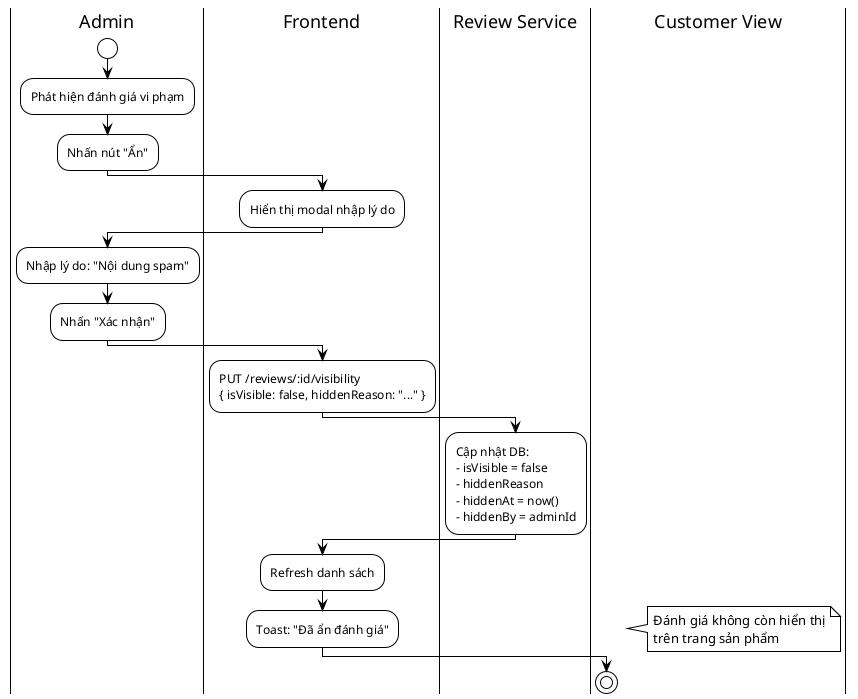

**Hình 3.X: Luồng ẩn đánh giá**

#### f) Xóa đánh giá và phân trang

Đối với đánh giá vi phạm nghiêm trọng như spam bot hoặc nội dung phản cảm, Admin có thể xóa vĩnh viễn bằng cách nhấn nút "Xóa" (icon thùng rác màu đỏ). Modal cảnh báo xuất hiện với thông điệp "Bạn có chắc muốn xóa đánh giá của [Tên người dùng]? Hành động này không thể hoàn tác!", yêu cầu Admin xác nhận trước khi thực hiện. Sau khi nhấn "Xóa", hệ thống gọi `DELETE /reviews/:id`, backend xóa document khỏi MongoDB, và KPI cards tự động cập nhật với tổng số đánh giá giảm đi. Thao tác xóa là không thể hoàn tác, do đó Admin nên ưu tiên dùng "Ẩn" thay vì "Xóa" để giữ lại dữ liệu cho mục đích audit. Danh sách đánh giá được phân trang với limit mặc định 10 đánh giá/trang, hiển thị thông tin "Hiển thị 1-10 trong tổng số 135 đánh giá" và navigation buttons bao gồm nút "Trang trước" (disabled khi ở trang 1), các số trang với smart pagination (1 ... 5 6 7 ... 14), nút "Trang sau" (disabled khi ở trang cuối), và current page được highlight màu crimson-600.

### 3.3.5.4. Database Collection

| Collection | Mô tả | Fields chính |
|---|---|---|
| **reviews** | Đánh giá sản phẩm | userId, productId, variantId, rating (1-5), content, images[], isVisible, hiddenReason, hiddenAt, hiddenBy, adminReply, adminReplyAt, adminId, createdAt, updatedAt |

**Indexes**: 
- `productId` (query đánh giá theo sản phẩm)
- `userId` (query đánh giá của user)
- `isVisible` (filter đánh giá hiển thị/ẩn)
- `rating` (filter theo số sao)
- `createdAt` (sắp xếp theo thời gian)

**Text Index**: `content` (full-text search trong nội dung đánh giá)

---

## 3.4. Tích hợp giữa các Services

Các services trong hệ thống SmartBuy không hoạt động độc lập mà liên kết chặt chẽ với nhau thông qua API Gateway và REST API calls. Dưới đây là các luồng tích hợp quan trọng:

### 3.4.1. Luồng đặt hàng (Order Flow)

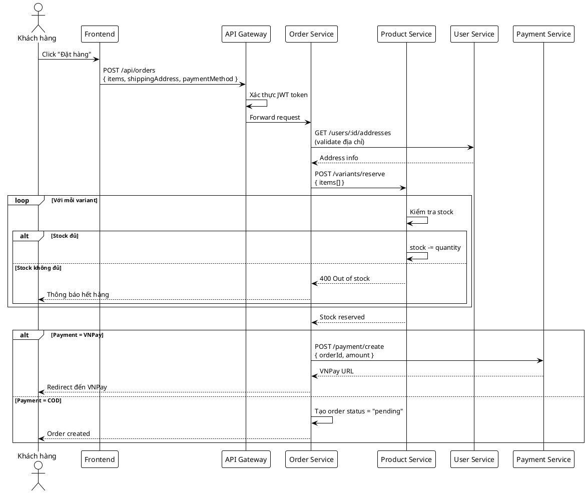

### 3.4.2. Luồng phân khúc khách hàng (Customer Segmentation)

User Manager Service cần truy vấn cross-database sang Order DB để tính tổng chi tiêu:

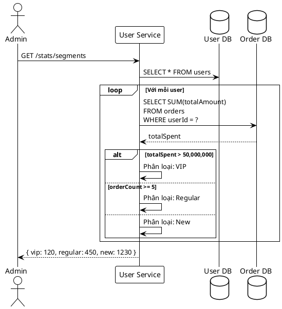

### 3.4.3. Luồng thống kê sản phẩm bán chạy

Product Service tích hợp với Order DB để thống kê sản phẩm bán chạy:

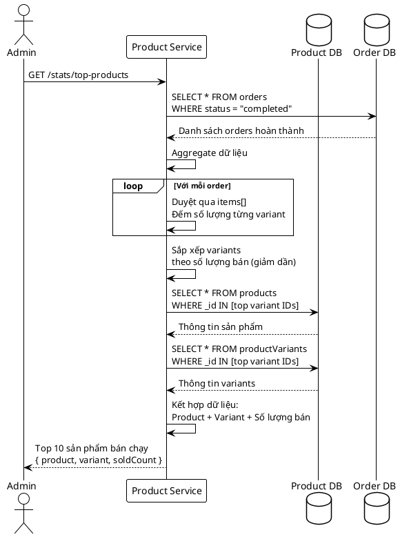

**Hình 3.X: Sơ đồ thống kê sản phẩm bán chạy**

---

## 3.5. Kết luận chương

Chương này đã trình bày chi tiết việc xây dựng 4 services chính trong kiến trúc microservices của hệ thống SmartBuy với góc nhìn từ giao diện Admin dashboard:

1. **API Gateway**: Điểm truy cập duy nhất với routing thông minh và authentication JWT, xử lý 100 requests/phút với rate limiting

2. **User Manager Service**: Cung cấp giao diện quản lý toàn diện cho Admin với các chức năng:
   - Tìm kiếm, lọc và phân trang người dùng
   - Thêm/sửa/xóa tài khoản với validation chặt chẽ
   - Khóa/mở khóa và phân quyền hàng loạt
   - Quản lý địa chỉ giao hàng cho từng user
   - Phân khúc khách hàng VIP/Regular/New dựa trên hành vi mua hàng
   - Biểu đồ thống kê trực quan (Doughnut, Bar, Pie charts)

3. **Product Manager Service**: Giao diện quản lý sản phẩm với cấu trúc 3 cấp Product-Variant-Image:
   - Quy trình thêm sản phẩm 2 bước: thông tin cơ bản → tạo variant
   - Quản lý variants với kiểm tra trùng lặp (màu + bộ nhớ)
   - Cập nhật tồn kho theo thời gian thực
   - Quản lý brands, categories, colors, memories qua tabs riêng biệt
   - Tích hợp Reserve/Release Stock API cho Order Service
   - Chức năng chọn nhiều và xóa hàng loạt với xác nhận

4. **Order Manager Service**: Dashboard quản lý đơn hàng với 11 trạng thái:
   - KPI cards hiển thị tổng quan: doanh thu, AOV, tỷ lệ hủy
   - Biểu đồ Line (doanh thu theo ngày) và Bar (phân bổ trạng thái)
   - Tìm kiếm và lọc đa tiêu chí (trạng thái, thanh toán, thời gian)
   - Xem chi tiết đơn với timeline lịch sử trạng thái
   - Cập nhật trạng thái với workflow validation
   - Hủy đơn hàng với hoàn trả tồn kho và hoàn tiền tự động
   - Email notification cho mỗi thay đổi trạng thái

5. **Review Service**: Quản lý đánh giá sản phẩm với dashboard trực quan:
   - KPI cards: tổng đánh giá, đánh giá trung bình, số lượng đang hiển thị/ẩn
   - Tìm kiếm và lọc theo rating (1-5 sao) và trạng thái hiển thị
   - Xem chi tiết đánh giá với ảnh đính kèm và thông tin người dùng
   - Phản hồi đánh giá từ Admin (admin reply)
   - Ẩn/hiện đánh giá với lý do cụ thể (content moderation)
   - Xóa đánh giá vi phạm chính sách
   - Phân trang và thống kê visibility (visible/hidden)

Các services được thiết kế theo nguyên tắc microservices: độc lập, có database riêng, giao tiếp qua REST API, dễ mở rộng và bảo trì. Giao diện Admin được xây dựng với Vue.js, Tailwind CSS, sử dụng Chart.js cho visualization, và tích hợp chặt chẽ với backend qua Axios. Mỗi thao tác quan trọng đều có modal xác nhận, validation chi tiết và thông báo rõ ràng để tránh sai sót.

Trong chương tiếp theo, luận văn sẽ trình bày về giao diện người dùng (customer-facing pages), các chức năng mua sắm, thanh toán và theo dõi đơn hàng từ góc nhìn khách hàng.
